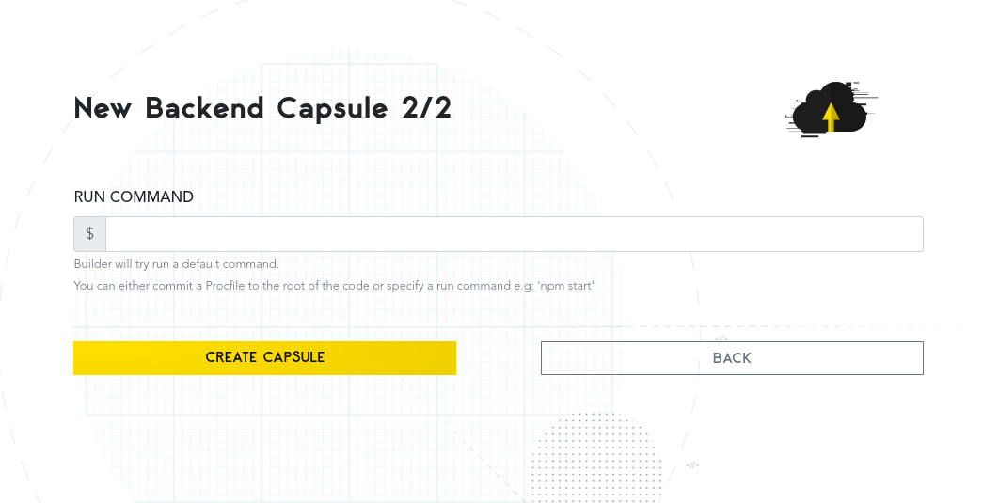
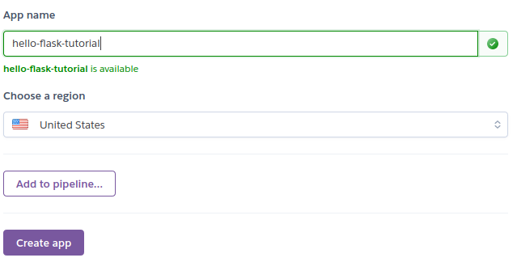
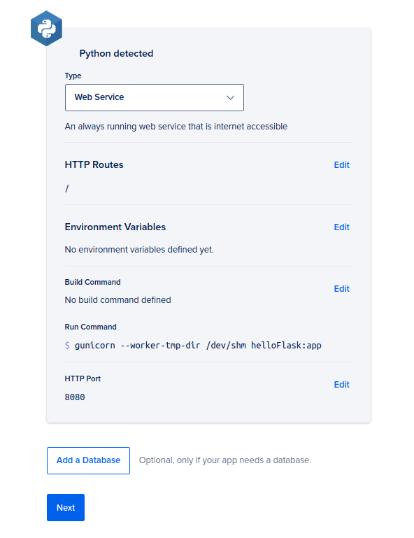

# The Easiest Serverless Platform? DigitalOcean vs Heroku vs Code Capsules - You Decide

Producing a web application which the entire world can use is complicated. You must setup a physical server,
choose the operating system, configure the server, and monitor the server. I tested three "Cloud platform as a Service" (PaaS) providers which perform all the above for you at a fraction of the time, and accept code from Github - the moment you push your code to your repositories' main branch on GitHub, the changes will be visible on your domain.

For the following platforms, I tracked two metrics detailed in the [benchmarks](#benchmarks) section reflecting ease of use for each:

- [Code Capsules](https://codecapsules.io/)
- [DigitalOcean App Platform](https://www.digitalocean.com/products/app-platform/) 
- [Heroku](https://www.heroku.com/)


This guide will help you decide which platform will get your web application to production the quickest and easiest. We will also learn how to use each platform by deploying a simple "Hello, world!" application written in Python with Flask for each platform provider. 

## Prerequisites

To follow this tutorial, you must have general programming knowledge and know how to use GitHub. This means you can send code from a local repository to a remote repository. You must also have:
  - [Python](https://www.python.org/downloads/) version 3.5 or above installed.
  - A [GitHub account](https://github.com/) and [Git](
    https://git-scm.com/book/en/v2/Getting-Started-Installing-Git) installed.
  - Pythons [virtualenv](https://pypi.org/project/virtualenv/) [installed](#installing-virtualenv).
  - A working credit card to test out DigitalOcean (free of charge).

The above links contain instructions on how to:
  - Install Python
  - Create a GitHub account
  - Install Git

### Installing virtualenv

If you already have virtualenv and know what it does, [skip](#creating-the-python-application) to the next section.


Using virtualenv, you can create a virtual Python environment. This virtual environment will contain only the essential modules for your web-application.

To install virtualenv, open
up your terminal and type:

`
pip3 install virtualenv
`

Now that you have a current version of Python, Git, a GitHub account, and virtualenv
installed, you can create the "Hello, world!" application.

## Creating the Python application

### Setting up the virtual environment

First, create a directory for your project. I named my directory "helloWorld". Open your command line, and enter the created directory.

Within the directory, create the virtual Python environment by typing
`virtualenv env`.

To activate the virtual environment, type the following from within the newly created directory:

__Linux/MacOSX__

`source env/bin/activate`

__Windows__

`env\Scripts\activate.bat`

Your terminal should now look something like this:


As in the image above, ensure that to the left of your username you see **(env)** or similar.
This means you have entered the virtual environment.

### Installing Flask and Gunicorn

For this web application we will be using two popular Python tools for web development; [Flask](https://flask.palletsprojects.com/en/1.1.x/) and [Gunicorn](https://gunicorn.org/):

  - Flask is a light-weight web-development framework for Python. It provides a number
of easy to use resources and tools for building and maintaining web applications,
websites, and similar services.

  - Gunicorn is our WSGI server of choice for sending our code to the production environment. Check out this link to read more about [WSGI servers](https://www.fullstackpython.com/wsgi-servers.html).

Install these tools with the following pip command. Ensure you are in your
virtual environment before running this command.

`pip3 install flask gunicorn`

### Coding the application

Now that we have setup our requirements, we can program our application. Create a
new Python file within the current directory and name it anything. I named mine
"helloFlask". Next, enter the following code.

```python
from flask import Flask

app = Flask(__name__) # __Name__ = name of program
@app.route('/') # Display on main page of the domain

def hello():
	return 'Hello, world!'

if __name__ == '__main__':
	app.run()
```

This program will display "Hello, world!" on the domain hosted by Code Capsules, Heroku, and DigitalOcean.

### Creating the Procfile

A Procfile is necessary to tell our platform of choice what to do with our code. You can read
more about what a Procfile does [here](https://devcenter.heroku.com/articles/procfile).

Create a new file within the same directory. Name it Procfile. After, open the Procfile and enter the following on the first line:

`web: gunicorn fileName:app`

 Replace "fileName" with the name of your Python file. Save the Procfile.

### Freezing the requirements

Our final step before uploading the web application to GitHub is to create a list of requirements for it.
This is necessary for the platform to know what to install to run our web application. Luckily, pip makes this easy. In the same terminal, enter:

`pip3 freeze > requirements.txt`

This will create a file titled "requirements.txt", that contains all the project's requirements. Your directory should look similar to this:
```
ProjectDirectory
+   env
+   helloFlask.py
+   requirements.txt
+   Procfile
```

### Uploading to Github

Send the Procfile, requirements.txt, and Python files to a remote repository on GitHub. If you are unfamiliar with how to do this, read [this](https://docs.github.com/en/free-pro-team@latest/github/importing-your-projects-to-github/adding-an-existing-project-to-github-using-the-command-line) article for further information.

With our application on GitHub, we will be able to link it to each platform we will test, and deploy our web application.

## Benchmarks

Code Capsules, DigitalOcean, and Heroku aim to make the process of taking and deploying code to a production environment as simple as possible. The rest of this article contains information on how to deploy our "Hello, world!" web application on each platform. Below I've included information my personal experience with how easy to use each platform was. 

To test how simple these platforms make this process, I performed the platform-specific instructions found in the coming sections twice. Each attempt I recorded how long it took me to get from GitHub to production. Below are the results in minutes and seconds.

|    Attempt #| Code Capsules| Heroku | DigitalOcean|
| ----------- |-------------|--------|---------------|
| 1           | 7 min 30 sec|   10 min 5 sec  |12 mins 11 sec|
| 2           | 4 min 45 sec       |      5  min 2 sec| 6 min 1 sec|

My first attempt represents the first time I've ever used these platforms. I found that Heroku has more UI clutter than the rest - mostly having to do with various options for increasing the price of the platform. I found the UI wasn't as intuitive for my goal - to deploy a Flask "Hello, world!" application to a website.

DigitalOcean and Code Capsules have a much more intuitive UI. However, DigitalOcean requires you to enter payment information upon account creation. DigitalOcean also took the longest time to deploy the application, which is reflected by its higher time-to-production for each attempt.

Because Heroku is more mature, it is hard to find an unused domain name. I attempted multiple names - Code Capsules accepted my first Capsule name immediately. DigitalOcean doesn't let you enter your own domain name, unless you tinker in the settings.

I also counted total number of UI clicks, that is, the total number of clicks after creating an account to get to a deployed product.

| Code Capsules| Heroku |DigitalOcean|
| ----------- |--------|-------|
| 8 clicks    | 9 clicks|   11 clicks |


Through this process, I found that Code Capsules was easier. As detailed in the [next](#code-capsules) section, Code Capsules follows a direct pipeline to deploy the web application. There is less to click on and less clutter to get to production - and doesn't require a credit card.

## Code Capsules

Code Capsules is the newest of the three platforms. Code Capsules is a PaaS alternative and advertises ease of use and time saved as their main advantages.

### Creating an account with Code Capsules and connecting to Github

First, we need to create an account with Code Capsules. Follow these instructions to get started:

1. Go to [Code Capsules](www.codecapsules.io).
2. Click "Sign Up" in the top right corner and follow the instructions.
3. Check your email and confirm your account.
4. Go back to [Code Capsules](www.codecapsules.io) and login into your newly created account.

After logging in, Code Capsules brings you to a page which will look similar to this. For now, ignore anything that you see on this picture that isn't on your account.


Now that we have created a Code Capsules account, we can connect Code Capsules to our GitHub account. Perform the following:

  1. Click your profile name on the top right corner and click edit profile.
  2. Under "GitHub" details, click the GitHub button.
  3. Under repository access, give Code Capsules access to our recently created repository.

We are now connected to GitHub! Only a few more steps to go. Navigate back to the main screen.

### Creating a team, space, and a capsule

Code Capsules organizes your code into three distinct containers:

- Teams
- Spaces
- Capsules

For this project, Capsules are the most important. To create a Capsule, we must create a team and space. A team allows you to invite multiple people to collaborate with you. You may assign team members to different spaces, which can contain different Capsules. Capsules provide cloud resources such as databases, API's, and servers.

Take these steps to get your code into production:

1. Click "Create a New Team" and name it anything.
2. Choose "Create a New Space For Your Apps".
3. Select your region (I chose the Netherlands for this tutorial).
4. Choose your name for the space.
5. Your space is now created! Click on your newly created space.
6. Click "Create a New capsule".
7. Choose the "Backend" Capsule.
8.  Select Sandbox.
9. Select the correct repository under "select your GitHub repository". Ensure the branch is set to main. Click next.
10. Because we have a Procfile in our repository, we do not need to use a run command. Instead, click "Create Capsule".



### Viewing your work

Now that you have created a Capsule, you can see your website.


Click on the "Overview" button. Your URL is displayed under "domain". Enter it into your browser to see your web application!

## Heroku

Heroku provides similar services to Code Capsules and DigitalOcean. Heroku is the original _Cloud platform as service_ (PaaS). Heroku aims to allow developers to focus on their core product, while they take care of the rest.

### Creating an account with Heroku and creating an application

We must first create a Heroku account. Do the following:

1. Go to www.heroku.com
2. Register an account by clicking Sign up in the top right corner
3. Log in to the registered account
4. Accept terms of service
5. Check your email and confirm your account

Now that we have created a Heroku account, we can create an application. An application is similar to the Code Capsules "Capsule".


1. Go to www.heroku.com and log in.
2. Click "Create new app"
3. Choose an app name that is not in use (I chose hello-flask-tutorial)
4. Choose your region (I chose the United States)
5. Click "Create app"



### Connecting to GitHub and sending to production

After creating your app, Heroku presents many options to you. Under Deployment method, click "Github", and follow these steps:

1. Click the connect to GitHub option, and perform the required tasks.
2. Now that you are connected to GitHub, type your repositories name under "Search for a repository to connect to". I've named mine "flask-hello".
3. Connect to this repository.


After connecting, click "Deploy Branch" in the "Manual Deploy" section at the bottom of the page. Wait until it has finished deploying. When deployment is finished, navigate to the top of the page and click "Open app" to see the result!

## DigitalOcean App Platform

The DigitalOcean App Platform is another PaaS alternative. It contains the same key features as Code Capsules and Heroku.

### Account creation and repository linking

DigitalOcean is the only platform here which requires a credit card. At the time of writing, DigitalOcean offers a free trial worth a $100 credit on their platform, so you will **not** be charged, until the $100 is spent. Ensure that you have canceled your billing account, so that you will not be charged in the future.

Create a new account by:

1. Visiting https://www.digitalocean.com/products/app-platform/.
2. Click the "Get Started" button, and sign up via email.
3. You will now need to enter your payment information - I chose a credit card.
4. Click "Deploy a Github Repo".
5. Click "Launch Your App".
6. Choose "Link your GitHub account".
7. Login to your GitHub account and press the "Only select repositories" button.
8. Pick the repository containing your Flask application.
9. Press the "Authorize and Install" button.
10. From the drop down menu, choose the repository containing the Flask application.


### Finishing steps and deploying your code

DigitalOcean redirects you to a new set of steps. Follow the remaining instructions carefully:

1. Choose your region - I chose New York.
2. Pick the proper branch you want to deploy from (default is "main").
3. Change the "run" command to `gunicorn --worker-tmp-dir /dev/shm file:app`
  - This is **important**. Without performing this step, your application will not deploy.
  - Change "file" to the name of your Python file (mine was "helloFlask").



4. Select the Basic plan.
5. Press "Launch Basic App" and your application will now be built.

View the application by entering the link under the applications name.
