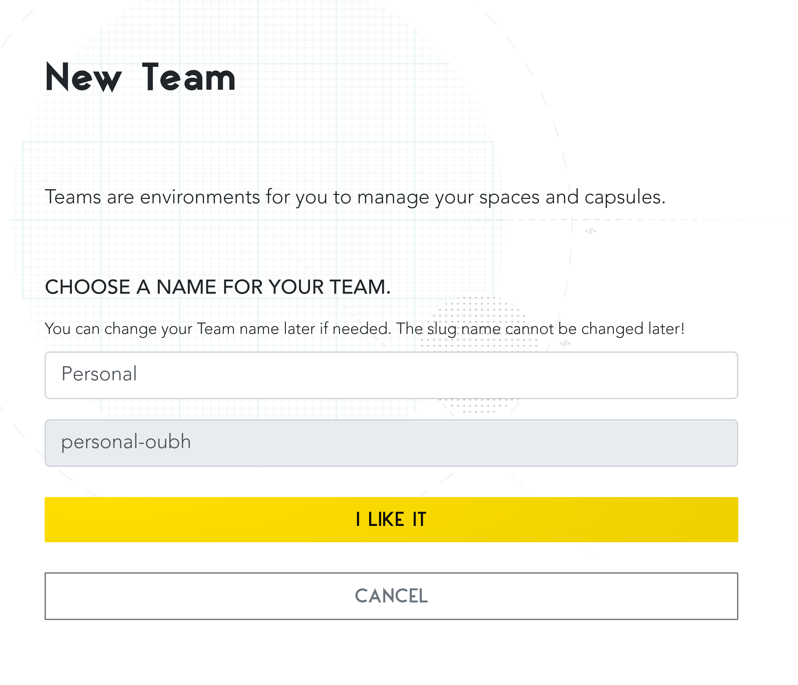
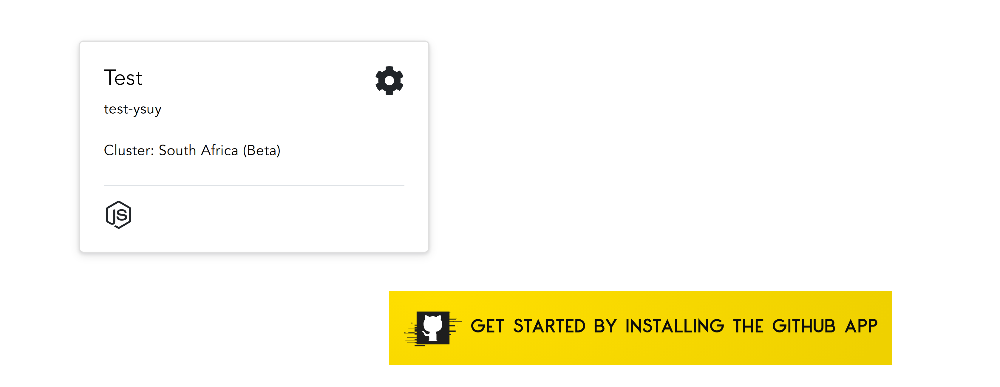
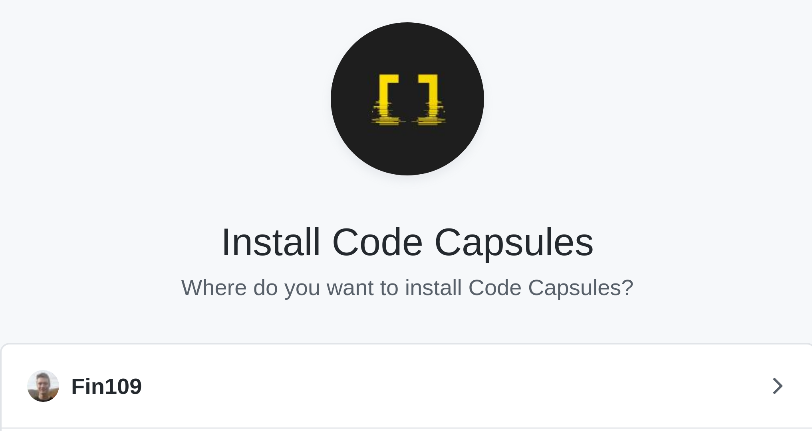
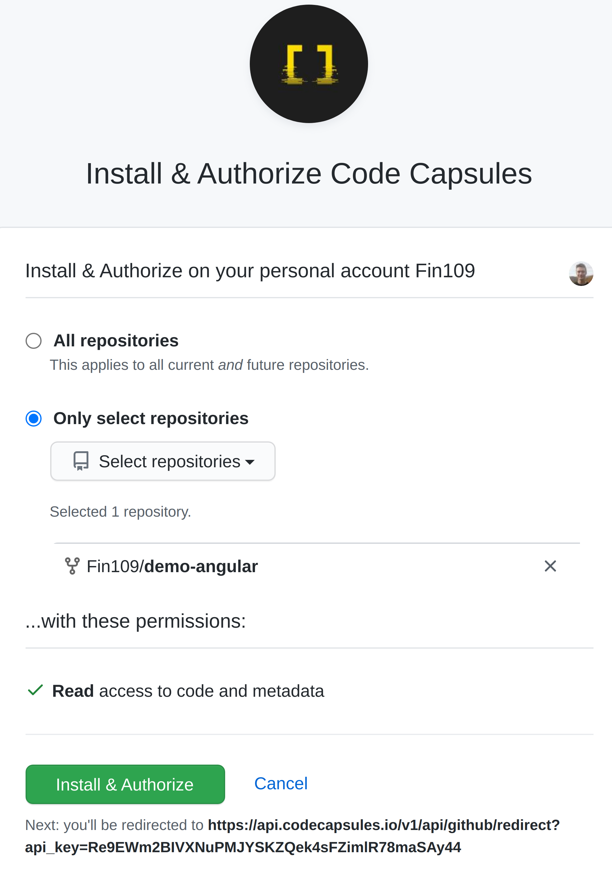

# Getting Started on Code Capsules with Angular 
Deploy an Angular application and learn how to host frontend code on Code Capsules. 

## Set up

Code Capsules connects to GitHub repositories to deploy applications - the only thing required for this tutorial is a [Code Capsules account](www.codecapsules.io) and a [GitHub account](www.github.com). Make sure to have both. 

To demonstrate deploying frontend code with Code Capsules, we'll use an Angular application already ready to be deployed. Find the application here: https://github.com/codecapsules-io/demo-angular.

To use it, fork the application by clicking "fork" at the top-right of the repository. With the Angular application forked to your GitHub account, we are ready to deploy it on Code Capsules.

## Creating a Team and Space

 

Log in to Code Capsules. After logging in, Code Capsules prompts you to create a team. A [Team](https://codecapsules.io/docs/faq/what-is-a-team/) is a tool that helps manage your various projects. Teams can have multiple members interacting with the projects associated with the Team. You can also add a credit card to your Team to handle [Capsule](https://codecapsules.io/docs/faq/what-is-a-capsule) billing. 

Click "Create A New Team" and name it whatever you'd like. After creating a Team, you'll be prompted to enter your Team's billing information. Billing information is required to host any applications but **you will not be charged** for hosting the Angular application. Once you've entered billing information, we need to create a [Space](https://codecapsules.io/docs/faq/what-is-a-space).

[Spaces](https://codecapsules.io/docs/faq/what-is-a-space) are another organizational tool for your applications. _You can create multiple spaces within a Team - each Space can consist of numerous Capsules_. Click the "Create A New Space" button and follow the prompts, naming the Space anything you'd like.

Now that we've created a Space, we need to connect the GitHub to Code Capsules.

## Linking to GitHub

Under the Space we've just created, click the "Get Started By Installing the GitHub App" button. Log in to GitHub, and when prompted to "Install Code Capsules", click on your GitHub user name (in the image below, I clicked on "Fin109").

After, choose "Only select repositories", and from the dropdown menu select the name of the forked Angular application. 

Press "Install & Authorize" and you'll return to Code Capsules. Let's deploy the Angular application. 

## Build the Capsule

It's time to create a [Capsule](https://codecapsules.io/docs/faq/what-is-a-capsule). Capsules provide the server for hosting applications on Code Capsules. We'll create a Capsule that hosts the Angular application that we just linked to Code Capsules. Press "Create a new capsule for your space" and:

1. Choose a "Frontend" Capsule.
2. Select the "Trial - Static Site Hosting" product.
3. Choose the GitHub repository we forked.
4. Press next.
5. Leave the "Build command" and "Static content folder path" blank and create the Capsule.

You can view the build logs under the "Logs" tab in your Capsule. When the Capsule builds, navigate to the "Overview" tab and click on the provided URL to view the application. 

For a closer look at a Capsules's properties, refer to this [explanation on Capsules](https://codecapsules.io/docs/faq/what-is-a-capsule/).