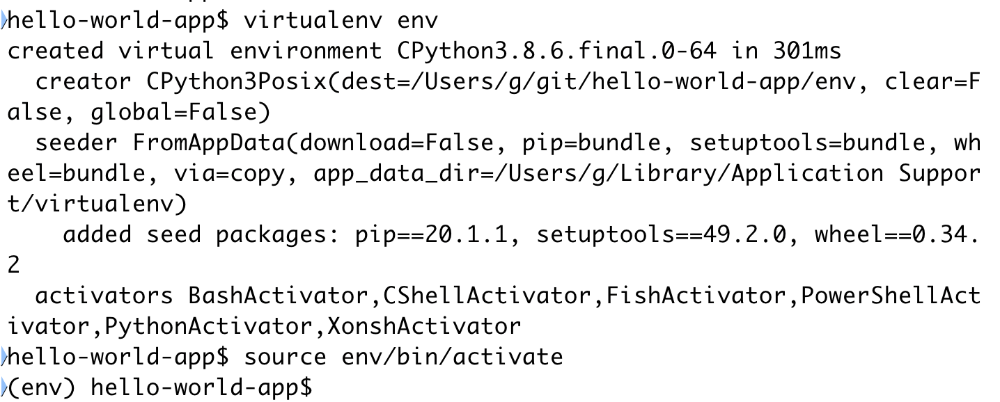
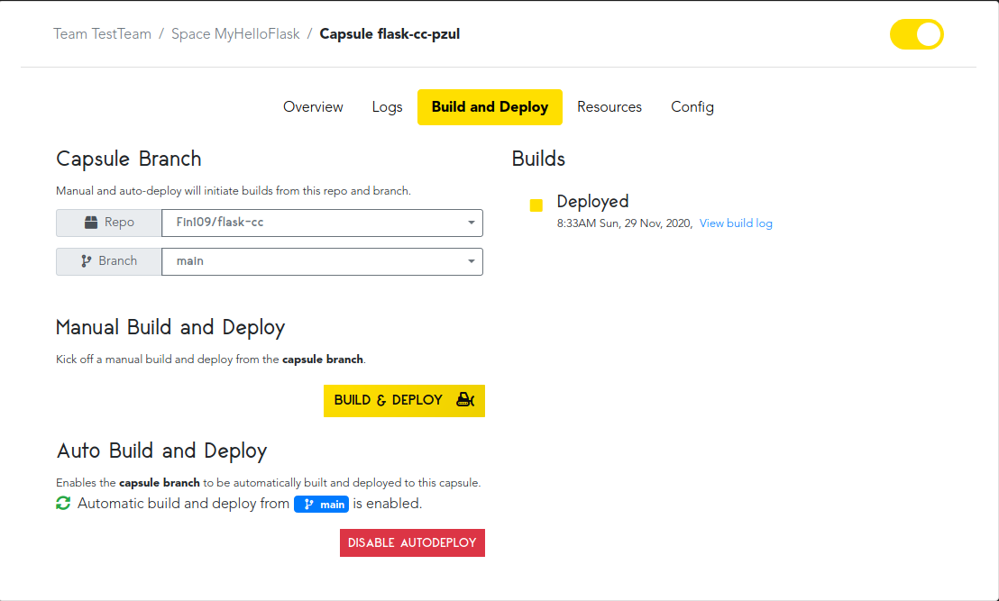
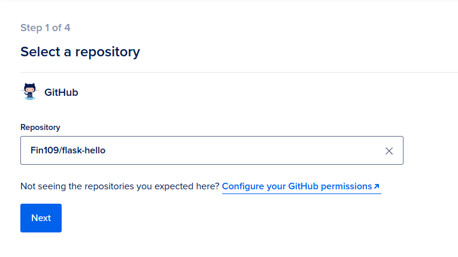

# Comparing PaaS providers: Heroku vs Digital Ocean vs Code Capsules

Deploying a web application to a production environment is complicated. Traditionally, you need to set up a web server including the operating system and supporting software and libraries. Then you need to deploy your code, configure it, and monitor it to ensure it keeps running.

Because most developers do not want to be so deeply involved in "operations", an alternative is to use a Platform-as-a-Service (PaaS) offering. These platforms need only minimal configuration and offer an integration with GitHub or similar so that you, as a developer, can simply push new code to your repository and have it deployed to a production environment automatically.

We deployed a basic Python (Flask) web application to three PaaS providers: Heroku, Digital Ocean App Platform, and Code Capsules. In this article, we compare these for ease-of-use and show step-by-step instructions on how to get started with each.

The platforms we tested are:

- [Heroku](https://www.heroku.com/)
- [DigitalOcean App Platform](https://www.digitalocean.com/products/app-platform/) 
- [Code Capsules](https://codecapsules.io/)

This guide will help you decide which platform to choose. We'll start with an overview of the metrics showing how long and how many clicks it took to deploy our simple "Hello, world!" application to each provider. 

## Ease of use benchmarks

We compared each platform on:

- The time it took to deploy the web application to production on each platform
- How complicated each platform's user interface is
- How intuitive the platforms were to use overall

These measurements are necessarily somewhat subjective, but by following the steps or taking a look at them below, you should be able to form your own opinion too.

### Timing results

To test the simplicity of each platform, we performed the platform-specific steps (as detailed later in this article) twice. Each attempt we recorded how long it took to get from GitHub to production. 

|    Attempt #| Code Capsules| Heroku | DigitalOcean|
| ----------- |-------------|--------|---------------|
| 1           | 7 min 30 sec|   10 min 5 sec  |12 mins 11 sec|
| 2           | 4 min 45 sec       |      5  min 2 sec| 6 min 1 sec|

Code capsules was the fastest in both runs, and also had the least difference in timing between runs, indicating that is simpler than the other two, with a smaller learning curve.

### Number of clicks 

We also counted the total number of UI clicks: that is, the number of clicks after creating an account to reach a deployed web application.

| Code Capsules| Heroku |DigitalOcean|
| ----------- |--------|-------|
| 8 clicks    | 9 clicks|   11 clicks |

### General impressions

Heroku's interface was the most complicated, providing many pricing and other options. As the most mature platform of the three, it has acquired more features over time, but these are generally a hinderance if you just want to deploy a basic application.

DigitalOcean provided a simpler platform, but requires payment details up front which slows down the initial process. 

Code Capsules was the simplest for a first-time user. It follows a simple pipeline of three steps to get from GitHub to production.

Finally, each platform offers a custom domain name to host your application. DigitalOcean generates a fully random name which can't be changed during the deployment process (though can be customized later in their settings page.) Heroku allows a customized domain, but as it is the most popular platform it is hard to find an available domain. The first name we chose on Code Capsules was accepted.

## Step-by-step guide to deploy to each provider

Let's take a look at how to create the web application we tested these platforms with, and how to deploy them to the platforms tested. 

## Prerequisites

To follow along you should have general programming knowledge and be able to use GitHub. This means you can send code from a local repository to a remote repository. You hould also have (instructions at each link):
  - [Python](https://www.python.org/downloads/) version 3.5 or above installed.
  - A [GitHub account](https://github.com/) and [Git](
    https://git-scm.com/book/en/v2/Getting-Started-Installing-Git) installed.
  - Python's [virtualenv](https://pypi.org/project/virtualenv/) [installed](#installing-virtualenv).
  - A working credit card to test out DigitalOcean (free of charge).

## General steps for building the web application

The following steps need to be carried out only once for all three providers. They will show you how to install local dependencies and create the hello world app.

### Installing virtualenv

If you already have virtualenv and know what it does, [skip](#creating-the-python-application) to the next section.

Using virtualenv, you can create a virtual Python environment. This virtual environment will contain only the essential modules for your web-application.

To install virtualenv, open up your terminal and type:

```bash
pip3 install virtualenv
```

Now that you have a current version of Python, Git, a GitHub account, and virtualenv
installed, you can create the "Hello, world!" application.

### Setting up the virtual environment

First, create a directory for your project. I named my directory "helloWorld". Open your command line, and enter the created directory.

Within the directory, create the virtual Python environment by typing
`virtualenv env`.

To activate the virtual environment, type the following from within the newly created directory:

__Linux/MacOSX__

`source env/bin/activate`

__Windows__

`env\Scripts\activate.bat`

Your terminal should now look something like this:



### Installing Flask and Gunicorn

For our web application we'll use two popular Python tools for web development: [Flask](https://flask.palletsprojects.com/en/1.1.x/) and [Gunicorn](https://gunicorn.org/):

  - Flask is a light-weight web-development framework for Python. It provides a number of easy to use resources and tools for building and maintaining web applications, websites, and similar services.
  - Gunicorn is a WSGI server for sending our code to the production environment. Check out this link to read more about [WSGI servers](https://www.fullstackpython.com/wsgi-servers.html).

Install these tools with the following pip command. Ensure you are in your
virtual environment before running this command.

`pip3 install flask gunicorn`

### Coding the application

Now that we have set up our requirements, we can write the code for our application. Create a
new Python file within the current directory and name it anything. I named mine
"helloFlask". Next, enter the following code.

```python
from flask import Flask

app = Flask(__name__) # __Name__ = name of program
@app.route('/') # Display on main page of the domain

def hello():
	return 'Hello, world!'

if __name__ == '__main__':
	app.run()
```

This program will display "Hello, world!" on the domain hosted by Code Capsules, Heroku, and DigitalOcean.

### Creating the Procfile

A Procfile is necessary to tell our platform of choice what to do with our code. You can read
more about what a Procfile does [here](https://devcenter.heroku.com/articles/procfile).

Create a new file within the same directory. Name it Procfile. After, open the Procfile and enter the following on the first line:

`web: gunicorn fileName:app`

Replace "fileName" with the name of your Python file. Save the Procfile.

### Freezing the requirements

Our final step before uploading the web application to GitHub is to create a list of requirements for it.
This is necessary for the platform to know what to install to run our web application. Luckily, pip makes this easy. In the same terminal, enter:

`pip3 freeze > requirements.txt`

This will create a file titled "requirements.txt", that contains all the project's requirements. Your directory should look similar to this:
```
ProjectDirectory
+   env
+   helloFlask.py
+   requirements.txt
+   Procfile
```

### Uploading to GitHub

Send the Procfile, requirements.txt, and Python files to a remote repository on GitHub. If you are unfamiliar with how to do this, read [this](https://docs.github.com/en/free-pro-team@latest/github/importing-your-projects-to-github/adding-an-existing-project-to-github-using-the-command-line) article for further information.

With our application on GitHub, we will be able to link the repository to each platform we test and deploy our web application.

## Provider specific steps

Each of the following steps are specific to one of the providers. If you only want to test one of them, skip to that section.

## Code Capsules

Code Capsules is the newest of the three providers and they advertise ease of use as their unique selling point.

### Creating an account with Code Capsules and connecting to GitHub

First, we need to create an account with Code Capsules. Follow these instructions to get started:

1. Go to [Code Capsules](www.codecapsules.io).
2. Click "Sign Up" in the top right corner and follow the instructions.
3. Check your email and confirm your account.
4. Go back to [Code Capsules](www.codecapsules.io) and login into your newly created account.

After logging in, Code Capsules brings you to a page that will look similar to this. For now, ignore anything that you see on this picture that isn't on your account.


Now that we have created a Code Capsules account, we can connect Code Capsules to our GitHub account. Perform the following:

  1. Click your profile name on the top right corner and click edit profile.
  2. Under "GitHub" details, click the GitHub button.
  3. Under repository access, give Code Capsules access to our recently created repository.

We are now connected to GitHub. Navigate back to the main screen.

### Creating a team, space, and a capsule

Code Capsules organizes your code into three distinct containers:

- Teams
- Spaces
- Capsules

These are different levels of organization to manage larger projects. For our purposes, we will only need one of each. 

To create a Capsule, we must create a team and space. A team allows you to invite multiple people to collaborate with you. You may assign team members to different spaces, which can contain different Capsules. Capsules provide cloud resources such as databases, APIs, and servers.

Take these steps to get your code into production:

1. Click "Create a New Team" and name it anything.
2. Choose "Create a New Space For Your Apps".
3. Select your region (I chose the Netherlands)
4. Choose your name for the space.
5. Your space is now created! Click on your newly created space.
6. Click "Create a New capsule".
7. Choose the "Backend" Capsule.
8. Select Sandbox.
9. Select the correct repository under "select your GitHub repository". Click next.
10. Because we have a Procfile in our repository, we do not need to use a run command. Instead, click "Create Capsule".


### Viewing your work

Now that you have created a Capsule, you can see your website.



Click on the "Overview" button. Your URL is displayed under "domain". Enter it into your browser to see your web application!

## Heroku

Heroku provides similar services to Code Capsules and DigitalOcean. Heroku is the original _Cloud platform as service_ (PaaS). Heroku aims to allow developers to focus on their core product, while they take care of the rest.

### Creating an account with Heroku and creating an application

We must first create a Heroku account. Do the following:

1. Go to www.heroku.com
2. Register an account by clicking Sign up in the top right corner
3. Log in to the registered account
4. Accept terms of service
5. Check your email and confirm your account

Now that we have created a Heroku account, we can create an application. An application is similar to the Code Capsules "Capsule".


1. Go to www.heroku.com and log in.
2. Click "Create new app"
3. Choose an app name that is not in use (I chose hello-flask-tutorial)
4. Choose your region (I chose the United States)
5. Click "Create app"


### Connecting to GitHub and sending to production

After creating your app, Heroku presents several options to you. Under Deployment method, click "GitHub", and follow these steps:

1. Click the connect to GitHub option, and perform the required tasks.
2. Now that you are connected to GitHub, type your repositories name under "Search for a repository to connect to". I've named mine "flask-hello".
3. Connect to this repository.


After connecting, click "Deploy Branch" in the "Manual Deploy" section at the bottom of the page. Wait until it has finished deploying. When the deployment is finished, navigate to the top of the page and click "Open app" to see the result!

## DigitalOcean App Platform

The DigitalOcean App Platform is another PaaS alternative. It contains the same key features as Code Capsules and Heroku.

### Creating an account and linking your repository 

DigitalOcean is the only platform here which requires a credit card. At the time of writing, DigitalOcean offers a free trial worth a $100 credit on their platform, so you will **not** be charged until the $100 is spent. Ensure that you have canceled your billing account so that you will not be charged in the future.

Create a new account by:

1. Visiting https://www.digitalocean.com/products/app-platform/.
2. Click the "Get Started" button, and sign up via email.
3. You will now need to enter your payment information - I chose a credit card.
4. Click "Deploy a GitHub Repo".
5. Click "Launch Your App".
6. Choose "Link your GitHub account".
7. Login to your GitHub account and press the "Only select repositories" button.
8. Pick the repository containing your Flask application.
9. Press the "Authorize and Install" button.
10. From the drop-down menu, choose the repository containing the Flask application.



### Finishing up and deploying your code

DigitalOcean redirects you to a new set of steps. Follow the remaining instructions carefully:

1. Choose your region - I chose New York.
2. Pick the proper branch you want to deploy from (default is "main").
3. Change the "run" command to `gunicorn --worker-tmp-dir /dev/shm file:app`
  - This is **important**. Without performing this step, your application will not deploy.
  - Change "file" to the name of your Python file (mine was "helloFlask").


4. Select the Basic plan.
5. Press "Launch Basic App" and your application will now be built.

View the application by entering the link under the application's name in your web browser.

## Conclusion

All three providers provide similar features but some of them are easier to use, especially for new users. They each provide auto-deploy functionality, meaning that you can largely forget about them after set up and simply push any changes to your GitHub repository. The integration with GitHub means that the provider will get a notification about the code changes and pull these changes into the production environment.