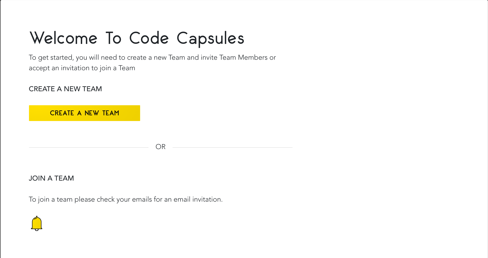
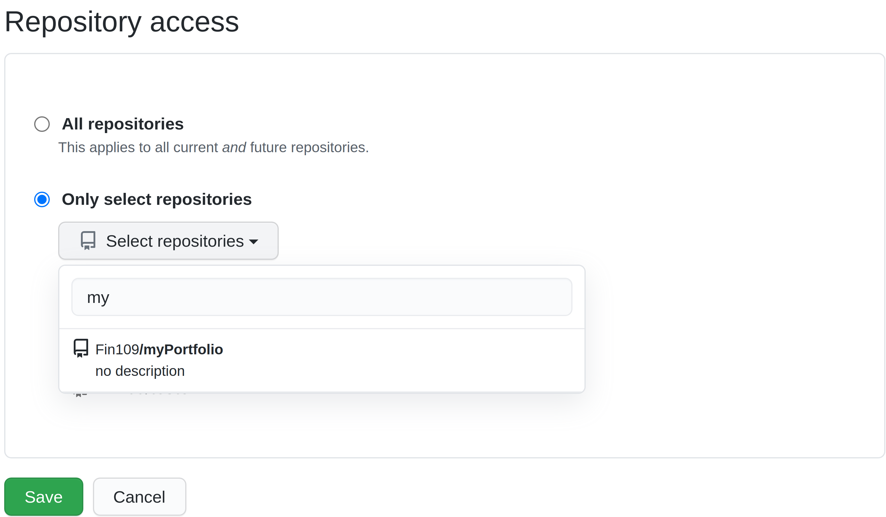
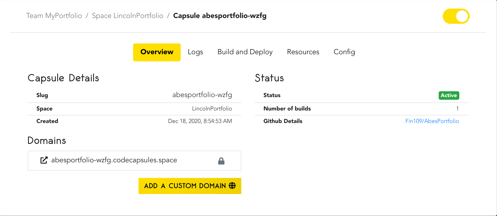

# Hosting a front-end website: building and hosting your professional portfolio

Deploying front-end data to a production environment is time-consuming and requires a decent knowledge of servers. In this tutorial, we'll learn how to build and view a portfolio locally, and make it public using [Code Capsules](https://codecapsules.io/) and a few commands.

As well as providing a server for us, Code Capsules: 

- Manages the server - you don't need to "babysit" it
- Integrates with GitHub to deploy your code with a single `git push`

The first half of this guide covers choosing and personalizing a portfolio template. After, we'll push the portfolio to a GitHub repository and see how Code Capsules interfaces with GitHub to make your portfolio public ([here](https://abesportfolio-wzfg.codecapsules.space/#) is an example).

## Requirements & Prerequisite knowledge

Hosting a portfolio on Code Capsules requires no previous knowledge about servers. To personalize a portfolio and deploy it to Code Capsules, we'll need:

- A text editor, such as [Sublime Text](https://www.sublimetext.com/), or [VSCode](https://code.visualstudio.com/). 
- A [GitHub](https://www.github.com) account and [Git](https://git-scm.com/book/en/v2/Getting-Started-Installing-Git) installed. 


## Creating a portfolio

[HTML5 UP](https/www.html5up.net) provides HTML5 site templates for free. We'll use the [Massively](https://html5up.net/massively) template. The Massively template is elegant and easy to edit.

Download the Massively template and extract it to a directory on your computer. **Within that directory, create _another_ directory, and transfer the template files into it**. This step is necessary for hosting a web-page on Code Capsules.

The names of both directories are irrelevant. The file structure should look something like this:

```
myPortfolio  
    portfolioFiles 
        + assets
        + images
        + generic.html
        + elements.html
        + index.html
```

 We'll only edit the `index.html` file in this tutorial. The `index.html` file contains all of the HTML code for our portfolio. 

### Personalizing the template

As an example, let's create a portfolio for Abraham Lincoln - the 16th president of the U.S.A. Looking at the template, you may have noticed some unnecessary things for a portfolio. Things Abraham Lincoln  won't need include:

- Social Media Accounts
- Extra tabs
- Date Entries 
- Irrelevant text
- Pagination
- Email contact form
- An address

Let's start with the title and subheading of the portfolio. To start editing, open the `index.html` file with a text editor. 

1. At the top of the file, change the text located within the `<title>` tags to whatever you like, e.g. "Abraham Lincoln". This is what will appear in search engines and browser tabs.

2. Customize the words wrapped in the `<h1>` tags.

3. Below the previously edited `<h1>` tags, edit the text within the `<p>` tags.  

4. Scroll down until you see text that looks like: `<!-- Header -->`, delete all text from `<header id="header">` down to and including the `</header>` tag.

Save the file and open it in a web browser. Our portfolio should now look something like this: 


Next, we need to delete the extra tabs, social media links, and dates above each portfolio piece. 

### Removing the tabs, dates, and links

To delete the unnecessary tabs, find these lines:

```html
<li class="active"><a href="index.html">This is Massively</a></li>
<li><a href="generic.html">Generic Page</a></li>
<li><a href="elements.html">Elements Reference</a></li>
```

Personalize the "This is Massively" text, and delete the two lines below containing the "Generic Page" and "Elements Reference" text.

The code for social media accounts is located at the top and bottom of the index.html file. Starting at the top, find and delete:

```html
<ul class="icons">
    <li><a href="#" class="icon brands fa-twitter"><span class="label">Twitter</span></a></li>
    <li><a href="#" class="icon brands fa-facebook-f"><span class="label">Facebook</span></a></li>
    <li><a href="#" class="icon brands fa-instagram"><span class="label">Instagram</span></a></li>
    <li><a href="#" class="icon brands fa-github"><span class="label">GitHub</span></a></li>
</ul>
```

At the bottom, find and delete this code-block:

```html
<section>
  <h3>Social</h3>
    <ul class="icons alt">
        <li><a href="#" class="icon brands alt fa-twitter"><span class="label">Twitter</span></a></li>
        <li><a href="#" class="icon brands alt fa-facebook-f"><span class="label">Facebook</span></a></li>
        <li><a href="#" class="icon brands alt fa-instagram"><span class="label">Instagram</span></a></li>
        <li><a href="#" class="icon brands alt fa-github"><span class="label">GitHub</span></a></li>
    </ul>
</section>
```

Finally, find and delete all lines that begin with `<span class="date"...>`. This will delete all the date entries in the portfolio.

### Personalizing text and removing other extraneous components

To complete the portfolio we'll

- Personalize default text
- Change the "Full Story" button's text
- Replace images with personal images
- Remove the contact form
- Update or remove the contact information
- Delete the "next" button


1. To alter the "Full Story" button's text, find lines similar to the below and change "Full Story"

  ```html
  <li><a href="#" class="button">Full Story</a></li>
  ``` 
 
2. Remove the email form feature by deleting the following code:

  ```html
  <section>
    <form method="post" action="#">
        <div class="fields">
            <div class="field">
                <label for="name">Name</label>
                <input type="text" name="name" id="name" />
            </div>
            <div class="field">
                <label for="email">Email</label>
                <input type="text" name="email" id="email" />
            </div>
            <div class="field">
                <label for="message">Message</label>
                <textarea name="message" id="message" rows="3"></textarea>
            </div>
        </div>
        <ul class="actions">
            <li><input type="submit" value="Send Message" /></li>
        </ul>
    </form>
 </section>
 ```

3. Remove pagination by deleting:

  ```html
  <footer>
    <div class="pagination">
        <!--<a href="#" class="previous">Prev</a>-->
        <a href="#" class="page active">1</a>
        <a href="#" class="page">2</a>
        <a href="#" class="page">3</a>
        <span class="extra">&hellip;</span>
        <a href="#" class="page">8</a>
        <a href="#" class="page">9</a>
        <a href="#" class="page">10</a>
        <a href="#" class="next">Next</a>
    </div>
  </footer>
  ```

To delete specific contact information sections (an example section is shown below), delete the `<section>` tag, the information you want to delete, and the corresponding `</section>` tag. 
```html
<section class="alt">
    <h3>Address</h3>
    <p>1234 Somewhere Road #87257<br />
    Nashville, TN 00000-0000</p>
</section>
```

We can customize contact information by editing the text within these sections. 


### Custom images and button linking

Our portfolio is almost complete - we just need to customize the images in the portfolio and the button links. First, let's customize the images: 

1. Find the images directory in the directory where the `index.html` file is located.
2. Place your image in the images directory - remember the images' name and file extension.
3. Find lines with `class="image main"` or `class="image fit"` - to the right, you will see `src="images/pichere.jpg"` - change the name of the image with your image name and file extension.

Change where buttons link to by locating `<article>` tags. Below each `<article>` tag, find the line that contains `class="button"`. On that line, find `href="#"` and replace the "#" with your link. 

Ensure to provide a full link, including `https://`. An example section for Abraham Lincoln looks like this:

```html
<article>
    <header>
        <h2><a href="#">The Gettysburg<br />
        address</a></h2>
    </header>
    <a href="#" class="image fit"></a>
    <p>One of my greatest qualities is my ability to deliver compelling speeches.</p>
    <ul class="actions special">
    <li><a href="https://en.wikipedia.org/wiki/Gettysburg_Address" class="button">Read More</a></li>
    /ul>
</article>
```

Once we're happy with the portfolio, we need to push it to GitHub so that it can be deployed to Code Capsules.

## Uploading to GitHub

Next, we'll push code from a local repository to a remote repository on GitHub. By doing this, we can connect our Code Capsules account to our GitHub repository so Code Capsules can automatically detect and deploy changes.

If you already know how to push code from a local repository to a remote repository on GitHub, push the sub-directory containing the portfolio to GitHub and [skip](#deploying-to-code-capsules) to the next section. 

Otherwise, read the following. 

### Creating the remote repository

Follow the steps below to create a remote repository on GitHub: 

- Go to www.github.com and log in.
- Find the "Create new repository" button and click it.
- Name your repository anything (in this image it was named "myPortfolio").
- Copy the URL given to you under "Quick setup".

    
    _The link to your repository is located under Quick setup_

### Sending files to the GitHub repository 

The final step before deploying our portfolio to Code Capsules is to send the files located in our local portfolio folder to GitHub. Open your terminal and navigate to the top-level directory you created. This directory should contain the sub-directory that has the portfolio files. Enter each command in order:

```
git init
git add .
git commit -m "First commit!"
git branch -M main
git remote add origin https://github.com/yourusername/yourrepositoryname.git  
git push -u origin main
```

Replace the URL above with the URL you copied in the previous section. 

Now you can see the portfolio code in your GitHub repository. Your repository should look similar to this, where all of your portfolio code is contained in a sub-directory (in this image the sub-directory is "portFolder"):


We are ready to host our portfolio on Code Capsules.

## Deploying to Code Capsules 

To deploy the portfolio to Code Capsules, navigate to https://codecapsules.io/, and create an account. After creating your account, log in. 

Follow the prompt to create a team. Code Capsules provide teams for collaborative development - you can invite other people to view and edit your web-applications by adding them to your team. 
Even if you're working alone, you'll still need a team (containing only yourself).



After creating a team, skip the prompt to add your team's billing information and to invite team members. 

### Linking the repository

We need to give Code Capsules permission to connect to our portfolio on GitHub. Click "Get Started By Installing The GitHub App".


You are redirected to GitHub to install Code Capsules.

1. Click your username.
2. Press "Only select repositories".
3. From the drop-down menu, type the name of the repository containing your portfolio and click it.
4. Press "Install & Authorize"
    
    

With CodeCaspsules connected to our portfolio, we can deploy it. 

### Creating a Space, Capsule, and viewing the portfolio

Next, we need to create a space. A space contains capsules - more on capsules soon. Click "Create a New Space For Your Apps" and follow the prompts. After creating a space, click on it.

Now we can create a capsule. Capsules contain code - this can be front-end or back-end data, or a database. Click "Create A New Capsule For Your Space".

You'll be prompted to choose a capsule type. Our portfolio contains only front-end code, so choose a "Frontend" capsule and:

1. Select your product type.
2. Click the repository that contains our portfolio.
3. Press "Next".
4. Leave the build command blank and enter the name of the sub-directory containing the portfolio files in the "Static Content Folder Path" entry box.

  

5. Press "Create Capsule". 

Your Capsule is now building. This process will make your portfolio visible online. After it has deployed, click the "Overview" tab, then press the link under "Domains" to view your portfolio.



## Conclusion


We've learned how to create a basic portfolio and push it to GitHub, and we've learned how to connect Code Capsules to Github to deploy our portfolio. Because we don't have a backend, we couldn't implement certain things like the contact form (which we removed). In the future, we'll look at "Backend" capsules - these will allow us to add more functionality to our portfolio. 
