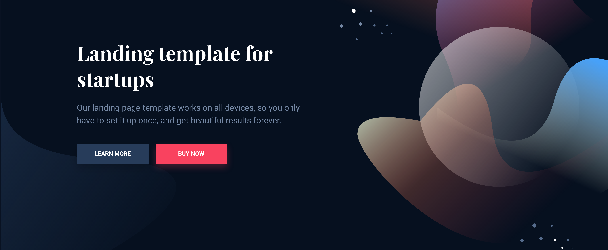
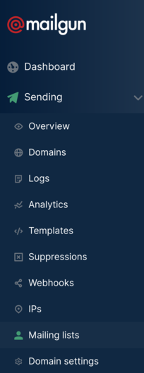
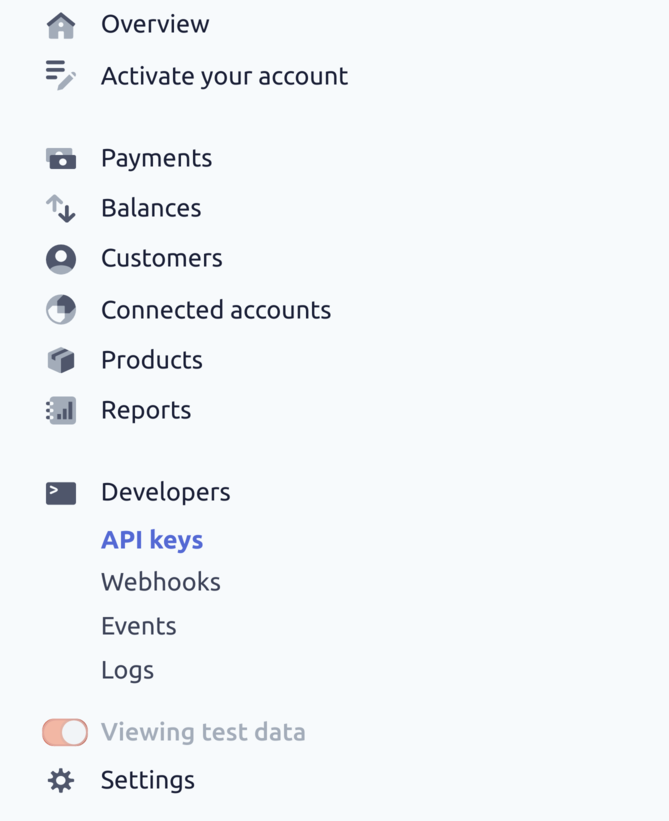
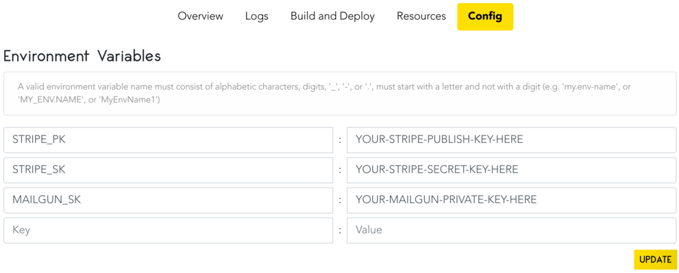

# Adding functionality to your web-application: Setting up Stripe Checkout and Email Subscription with Flask and Code Capsules

## Todays goal

Constructing a frontend for your web-application is the first step towards providing an interactive user experience. The next step is building a working backend - making your web-application functional. That's what we'll focus on today. 

Through a step-by-step process, we'll develop this functionality. At the end of this tutorial, we'll have produced a web-application allowing users to buy products through [Stripe Checkout](https://stripe.com/payments/checkout) (a tool for creating a "checkout" process for products) and subscribe to an email list with help from the [Mailgun](https://www.mailgun.com/ ) email API service.

## Requirements

To work on this project, make sure to have:

- A text editor (like [Sublime](www.sublimetext.com) or [VSCode](https://code.visualstudio.com/)).
- [Python 3.XX+](https://www.python.org/downloads/) installed.
- [Virtualenv](https://pypi.org/project/virtualenv/) installed.
- [Git](https://git-scm.com/) installed and a [GitHub](https://github.com/) account.
- A [Code Capsules](www.codecapsules.io) account. 

## Setting up the frontend

We'll use the [laurel](https://cruip.com/laurel/) frontend template from https://cruip.com to add our functionality to. This template is perfect for our project - we'll only need to make a few modifications to it. Download this template. After downloading laurel, follow these steps:

1. Create a directory named `project`.

2. Within the `project` directory, create a sub-directory named `templates`. 

3. Open the laurel template and extract the files within the `laurel` directory into the `templates` subdirectory. 

View the template by opening the `index.html` file in the `templates` sub-directory. We'll add Stripe Checkout functionality to the first "Early access" button and email subscription functionality to the second "Early access" button (located at the bottom of the template).  

The "Early access" button text doesn't make sense for our project - let's fix that. 

### Editing the template - changing button text

Start by changing the first "Early access" button to "Buy Now". Open the `index.html` file in a text editor. Find the line

```html
<div class="hero-cta"><a class="button button-shadow" href="#">Learn more</a><a class="button button-primary button-shadow" href="#">Early access</a></div>
```

and replace it with:

```html
<div class="hero-cta"><a class="button button-shadow" href="#">Learn more</a><a id='checkout-button' class="button button-primary button-shadow" href="#">Buy Now</a></div>
```

Here we've changed "Early access" to "Buy Now" and added `id=checkout-button`. The latter will be useful when implementing Stripe Checkout. 

Next, find the line 

```html
<a class="button button-primary button-block button-shadow" href="#">Early access</a>
```

and replace "Early access" with "Subscribe".

To see view the changes, save the `index.html` file and re-open it in a web-browser. We have one more task before building our Flask backend.

### Project directory restructuring 

For Flask to render our `index.html` file, we need to make some further modifications to the template. 

1. In the `project` directory create a new directory named `static`. 

2.  Navigate to the `templates` directory and then the `dist` directory. 

3. Copy all of the directories located in the `dist` directory into the newly created `static` directory.

Your `project` file structure should look like this:

```
project
    static
      css
        + style.css
      images
        + iphone-mockup.png
      js
        + main.min.js
    templates
```

This is necessary because Flask **strictly** renders static content in folders named `static`, and renders `.html` files located within `templates`. Because we changed file locations, we need to edit our `index.html` file.

Open the `index.html` file in the templates folder and replace the line

```html
<link rel="stylesheet" href="dist/css/style.css">
```
with:

```html
<link rel="stylesheet" href="{{url_for('static',filename='css/style.css')}}">
``` 

`url_for()` helps Flask find the location of our `style.css` file when rendering the `index.html` file. Read more about `url_for()` at the [end](#conclusions) of the article.

Speaking of Flask - it's time to create the backend. 

## Setting up the virtual environment

We'll create a [Virtual environment](https://docs.python.org/3/library/venv.html) for our project. To create a Virtual environment, navigate to the `project` directory in a terminal, and enter `virtualenv env`.

Activate the virtual environment with:

**Linux/MacOSX** `source env/bin/activate`

**Windows** `\env\Scripts\activate.bat`

If the virtual environment was activated properly, you'll notice `(env)` to the left of your name in the terminal. Keep this terminal open - we'll download the project requirements next. 

### Installing the requirements 

We'll use the following libraries for our project:

- [Flask](https://flask.palletsprojects.com/en/1.1.x/) is a lightweight Python web development framework. 

- [Gunicorn](https://gunicorn.org/) is a [WSGI server](https://en.wikipedia.org/wiki/Web_Server_Gateway_Interface) we'll use to host our application on Code Capsules. 

- [Requests](https://pypi.org/project/requests/) is a Python library that allows us to send [HTTP/1.1 requests](https://www.w3.org/Protocols/rfc2616/rfc2616-sec5.html).  

- [Stripe](https://pypi.org/project/stripe/) is another Python library that will help us interact with the [Stripe API](https://stripe.com/docs/api).

Install these by entering  `pip install flask gunicorn requests stripe` within the virtual environment

Now we can create the first iteration of our Flask application.

## Creating the Flask application

In the `projects` folder, create a new file named `app.py`. Open it in a text editor and enter the following code. 

```python
from flask import Flask, render_template, url_for, request, jsonify
import requests, stripe, os

app = Flask(__name__)


@app.route("/",methods=["GET","POST"]) 
def index():
	return render_template("index.html")


if __name__== '__main__':
	app.run(debug=True)   
```

Note `render_template("index.html")`. This is where Flask reads the `index.html` file. It knows the location of the `index.html` file because Flask knows to look at the `templates` directory for `.html` files. 

Now run `app.py`. Open the provided IP address in your browser - the web-application should look like this:



Let's make this web-application useful and implement the first bit of functionality - the email list feature.

### Signing up for Mailgun 

We'll use [Mailgun](https://www.mailgun.com/) to handle our email subscriber list. Mailgun is free, provided one doesn't exceed 5,000 emails per month. [Register with Mailgun](https://signup.mailgun.com/new/signup) and continue.

With an account registered, create a mailing list by:

1. Logging in to Mailgun.

2. Clicking "Sending" then "Mailing lists" on the dashboard.

     

3. At the top right, press "Create mailing list"

4. Enter in whatever you'd like for the address prefix, name, and description - leave everything else default.

5. Click "Add mailing list"

We'll use this mailing list shortly - keep this page open for now.

## Implementing the subscribe button

With the mailing list created, we can create the "Subscribe" button functionality. 

Re-open the `index.html` file. At the bottom of the file, find the line:

```html
 <section class="newsletter section">
``` 

From the above line down to its corresponding `</section>` tag, replace all of the code with the following:

```html
<section class="newsletter section">
  <div class="container-sm">
    <div class="newsletter-inner section-inner">
      <div class="newsletter-header text-center">
        <h2 class="section-title mt-0">Stay in the know</h2>
        <p class="section-paragraph">Lorem ipsum is common placeholder text used to demonstrate the graphic elements of a document or visual presentation.</p>
      </div>
      <form method="POST">
        <div class="footer-form newsletter-form field field-grouped">
          <div class="control control-expanded">
            <input class="input" type="email" name="email" placeholder="Your best email&hellip;">
          </div>
          <div class="control">
            <button class="button button-primary button-block button-shadow" type="submit">Subscribe</a>
            </div>
          </div>
        </form>
      </div>
    </div>
</section>
```

Here we've added a `POST` method. We'll use this to identify when a user has entered their email in the text box. 

### Subscribe functionality in Flask

Return to the `app.py`  file. Above the

```python
@app.route("/",methods["GET","POST"]) 
```
line, enter:

```python
def subscribe(user_email, email_list, api_key):
	return requests.post(
        "https://api.mailgun.net/v3/lists/"+email_list+"/members",
        auth=('api', api_key),
        data={'subscribed': True,
              'address': user_email,})
```

When a user hits the "Subscribe" button, this function is called. It takes three variables:

- `user_email`: The email the user has entered.

- `email_list`: Your Mailgun alias address.
	- Navigate to the mailing list we just created. Retrieve your Mailgun alias by clicking on the mailing list and finding the alias under the "Alias address" section.


- `api_key`: Your Mailgun secret API key.
	- Find the API key by clicking on your account at the top right of the screen. Click "API keys", and note your private API key.


Modify the current `index()` function as bwloe, replacing `MAILGUN_ALIAS` and `PRIVATE_MAILGUN_APIKEY` with the alias and API key previously retrieved:

```python
@app.route("/",methods["GET","POST"]) 
def index():
	if request.method == "POST":
		user_email = request.form.get('email') 
		response = subscribe(user_email,
			'MAILGUN_ALIAS',
			`PRIVATE_MAILGUN_APIKEY`) 

	return render_template("index.html")
```

Try it out - enter an email address and hit "Subscribe". Navigate back to the mailing lists tab on Mailgun and click on the list we created, the email address entered will be under "Recipients".

All that's left is to add functionality to our "Buy Now" button. 

## Implementing "Buy Now" with Stripe Checkout

Stripe Checkout allows business owners to accept payments on their web-applications. Let's create an account with [Stripe Checkout](https://dashboard.stripe.com/register). After creating an account, log in and find your API keys by clicking "Developers" then "API keys" on the dashboard. 



Open the `app.py` file. Above the subscribe function, add the following lines, replacing `YOUR PUBLIC KEY HERE` and `YOUR PRIVATE KEY HERE` appropriately:

```python
app.config['STRIPE_PUBLIC_KEY'] = 'YOUR PUBLIC KEY HERE'
app.config['STRIPE_PRIVATE_KEY'] = 'YOUR PRIVATE KEY HERE'
stripe.api_key = app.config['STRIPE_PRIVATE_KEY']
```

These are test API keys that we'll use to check out our product - with these keys, no charge will incur for making a payment. However, before we can make a payment, we need a product - let's create one. While logged in on Stripe, navigate to the "Products" tab on the dashboard. 

### Creating a product

Do the following:

1. Click "Add product" on the top right.
2. Name the product.
3. Add a description and price.
4. Choose "One time" payment.
    

5. Click "Save product"

After the last step, save the API key found in the "Pricing" section. We'll use this API key next. 

### Adding functionality in Flask

Time to create the "Buy Now" button logic. Open `app.py` again and modify the index function accordingly. Replace "YOUR-PRICE-API-KEY" with the API key saved in the previous section. 

```python
@app.route("/",methods=["GET","POST"]) 
def index():
	session = stripe.checkout.Session.create(
		payment_method_types=['card'],
		mode = 'payment',
		success_url = 'https://example.com/success',
		cancel_url = 'https://example.com/cancel',
		line_items=[{'price':'YOUR-PRICE-API-KEY',
					'quantity':1,
		}]
		)

	if request.method == "POST":
		user_email = request.form.get('email') 
		# user_email is your alias found in mailing lists
		response = subscribe(user_email,
			'my_list@sandboxc67e2c0ba1e64bdbb055e64d41135bb4.mailgun.org',
			'YOUR-MAILGUN-SECRET-KEY') # < Private mailgun apikey

	return render_template("index.html", 
		checkout_id=session['id'],
		checkout_pk=app.config['STRIPE_PK'],
		)
```

We use the `stripe` library to create a new "Session" object. This object contains multiple variables affecting how our customers interact with the "Buy Now" button. For more information on these variables, read Stripes [documentation](https://stripe.com/docs/api/checkout/sessions/object)

Also not, we return two new variables - `checkout_id` and `checkout_pk`. `checkout_id` stores information about the potential purchase (price, payment type, etc). The `checkout_pk` variable stores our private API key - when a customer buys our product, the money sends to the account associated with this private API key.

We'll see how our HTML code will utilize these values and redirect us to the Stripe Checkout page next. 

### Button functionality in the HTML file

With our Flask logic finished, we can add button functionality in our `index.html` file. Open the `index.html` and and find the section:

```html
<div class="hero-copy">
	<h1 class="hero-title mt-0">Landing template for startups</h1>
	<p class="hero-paragraph">Our landing page template works on all devices, so you only have to set it up once, and get beautiful results forever.</p>
	<div class="hero-cta"><a class="button button-shadow" href="#">Learn more</a><a id='checkout-button' class="button button-primary button-shadow" href="#">Buy Now</a></div>
</div>

```

Directly below the `</div>` line, add:

```html

<script src="https://js.stripe.com/v3/"></script>
<script>
	const checkout_pk= '{{checkout_pk}}';
	const checkout_id = '{{checkout_id}}';
	var stripe = Stripe(checkout_pk)
	const button = document.querySelector('#checkout-button')

	button.addEventListener('click', event =>{
		stripe.redirectToCheckout({
			sessionId: checkout_id
			}).then(function(result){

				});
				})
</script>
```

This code adds a Javascript event - when a customer clicks the "Buy Now" button, the customer redirects to the Stripe Checkout page. The stripe checkout page changes according to the information stored in `checkout_id`

Also take a look at the lines: 

```javascript
const checkout_pk= '{{checkout_pk}}';
const checkout_id = '{{checkout_id}}'; 
```

These variables evaluate to the variables returned when calling the `render_template()` function in `app.py`. They are wrapped in curly-braces, as render_template uses the [Jinja](https://jinja.palletsprojects.com/en/2.11.x/) templating language.

The "Buy Now" button is good to go - run `app.py` again. Try making a payment -  use the credit card number `4242 4242 4242 4242`(This is a [test credit-card number](https://stripe.com/docs/testing), no charges will incur with its use) and enter any name, expiration date, and security code.


## Hosting the application on Code Capsules

Now that we've added all the functionality, we need to perform a couple more tasks before hosting our application online. 


### Creating the requirements.txt file and Procfile

To host this application on Code Capsules, we need to create a requirements.txt file and a Procfile. 

1. In the `project` directory, ensure you the virtual environment is activated and enter `pip3 freeze > requirements.txt`. 

2. Create another file named `Procfile` and add the line `web: gunicorn app:app` - save the `Procfile`.


### Removing secret keys

We need to send our application to GitHub so Code Capsules can host it. Remember - this project contains all of our API-keys. It is considered **very** poor practice to send personal API-keys to GitHub - anyone could use them and incur charges on your debit card. Luckily, there is a workaround. 

By working with [Environment variables](https://opensource.com/article/19/8/what-are-environment-variables), we can use our API-keys without exposing them on GitHub. We'll soon add environment variables containing our API keys on Code Capsules.

If you haven't worked with Environment variables before, their use will be clear when we get to hosting the application on Code Capsules.

To access the environment variables we'll set on Code Capsules, use this final iteration of our Flask application:

```python

from flask import Flask, render_template, url_for, request, jsonify
import requests, stripe, os


app = Flask(__name__)
app.config['STRIPE_PK'] = os.getenv("STRIPE_PK")
app.config['STRIPE_SK'] = os.getenv("STRIPE_SK")
stripe.api_key = app.config['STRIPE_SK']


def subscribe(user_email, email_list, api_key):
	return requests.post(
        "https://api.mailgun.net/v3/lists/"+email_list+"/members",
        auth=('api', api_key),
        data={'subscribed': True,
              'address': user_email,})

@app.route("/",methods=["GET","POST"]) 
def index():
	img_url = url_for('static', filename='images/iphone-mockup.png')

	session = stripe.checkout.Session.create(
		payment_method_types=['card'],
		mode = 'payment',
		success_url = 'https://example.com/success',
		cancel_url = 'https://example.com/cancel',
		line_items=[{'price':'price_1I9xueJaVOFHXZDzV46F934h',
					'quantity':1,
		}]
		)

	if request.method == "POST":
		user_email = request.form.get('email') 
		# user_email is your alias found in mailing lists


		response = subscribe(user_email,
			'my_list@sandboxc67e2c0ba1e64bdbb055e64d41135bb4.mailgun.org',
			os.getenv("MAILGUN_SK")) # < Private mailgun apikey

	return render_template("index.html", 
		checkout_id=session['id'],
		checkout_pk=app.config['STRIPE_PK'],
		img_url = img_url)

if __name__== '__main__':
	app.run(debug=True)   

```

The changes:

- We've replaced `app.config['STRIPE_PK']`, `app.config['STRIPE_SK']` and the the Mailgun private key with: `app.config['STRIPE_PK'] = os.getenv("STRIPE_PK")`, `app.config['STRIPE_SK'] = os.getenv("STRIPE_SK")`, and `os.getenv("MAILGUN_SK")` respectively.

`os.getenv("ENV-VAR-NAME-HERE")` retrieves any environment variable named within the quotation marks. On Code Capsules, we'll set environment variables named `'STRIPE_PK'`, `'STRIPE_SK'`, and `'MAILGUN_SK'`. This way, our API keys will remain secret. 

We can now safely host our application.

### Pushing the application to GitHub and hosting the application on Code Capsules

Take the following steps before we create a Capsule that will host our code:

1. Create a GitHub repository for the application.
2. Send all code within the `project` directory to the repository on GitHub.
3. Log in to [Code Capsules](www.codecapsules.io).
4. Grant Code Capsules access to the repository.
5. Create a Team and Space as necessary. 

Let's create the Capsule: 

1. Press "Create A New Capsule".
2. Select your repository.
3. Choose the Backend Capsule type.
4. Create the Capsule.

As mentioned before, we need to set the environment variables. Navigate to the Capsule and click on the "Config" tab. Use the image below as a guide to properly add your environment variables. Replace each value with the appropriate API key. 



After entering the API keys, __make sure to click update__. 

All done - now anyone can view the web-application and interact with the "Buy Now" and "Subscribe" buttons.

## Conclusion

We covered a lot in this tutorial - how to use Flask to implement functionality for frontend code, how to set up an email subscriber list, and how to work with Stripe. 

Earlier I mentioned more information on the `url_for()` function. Check out [Flasks documentation](https://flask.palletsprojects.com/en/1.1.x/api/#flask.url_for) for more information. 

For further information on how `render_template()` works, or if you  wanted to know what that `const checkout_pk= '{{checkout_pk}}';` line was doing, check out this link to learn more about [Flask templating and Jinja2](https://realpython.com/primer-on-jinja-templating/). 

Now that you have a functional email-subscriber list, you may be interested in [sending emails to your list](https://documentation.mailgun.com/en/latest/user_manual.html?highlight=template%20variables#sending-messages).